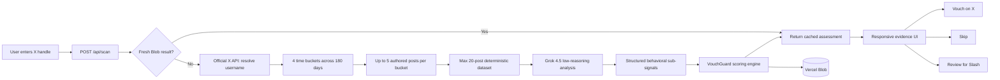

# VouchGuard AI

> **Scan before you vouch.** Account-level X intelligence for Commons vouch/slash decisions.

VouchGuard AI is a responsive Next.js application that evaluates a **public X account as a whole** before a user spends a scarce Commons action.

Production uses a hybrid architecture:

1. The **official X API** resolves the exact account and retrieves a bounded, time-distributed sample of authored posts.
2. **Grok 4.5** analyzes that deterministic dataset for behavioral patterns.
3. VouchGuard's own TypeScript scoring engine computes the final metrics.
4. The user reviews evidence and decides whether to **Vouch**, **Skip**, or **Review for Slash**.

The public metrics are deliberately separate:

- **Authenticity** — continuity of identity, original expression, meaningful conversations and persistent interests/projects.
- **Farmer Risk** — behavior heavily optimized around rewards, points, quests, airdrops, reciprocal engagement or vouch farming.
- **Bot Risk** — automation-like cadence, mechanical templating, repeated replies or implausible activity patterns.
- **Sybil Risk** — evidence of coordinated/closed-network behavior. This is a risk signal, **not proof of shared ownership**.
- **Vouch Confidence** — a decision-support summary derived from the four metrics above.

VouchGuard never posts automatically and never automatically slashes an account.

---

## Why VouchGuard exists

Commons gives users the ability to Vouch and Slash, but the difficult part is deciding **what kind of account is behind a handle**.

A single Commons post is a poor signal. Required command syntax is repetitive, real humans participate in campaigns, and a genuine person may also farm incentives. VouchGuard therefore evaluates account-level behavior instead of judging one post or one keyword.

The product also distinguishes:

- a genuine human from an automated account;
- a genuine human who farms incentives from a bot;
- weak/sparse evidence from actual suspicious evidence;
- coordination risk from proof of Sybil ownership.

If data is not good enough, VouchGuard returns **UNSCORABLE** rather than inventing a neutral-looking score.

---

# Product workflow



## System overview

```mermaid
graph TB
  subgraph Browser[Desktop / Mobile]
    HOME[Scanner]
    ASSESSMENT[Assessment]
    PUBLIC[Public /u/:handle page]
  end

  subgraph Vercel[Next.js on Vercel]
    SCAN[/api/scan]
    HEALTH[/api/health]
    RL[Rate limiter]
    XA[X API adapter]
    ORCH[Scan orchestrator]
    ENGINE[Deterministic scoring]
    BLOB[Vercel Blob cache]
  end

  subgraph X[X Platform]
    LOOKUP[User lookup]
    TIMELINE[User Posts timeline]
  end

  subgraph xAI[xAI]
    RESPONSE[Responses API]
    GROK45[Grok 4.5]
    XSEARCH[Native X Search fallback]
  end

  HOME --> SCAN
  SCAN --> RL
  SCAN --> BLOB
  SCAN --> ORCH
  ORCH --> XA
  XA --> LOOKUP
  XA --> TIMELINE
  TIMELINE --> RESPONSE
  RESPONSE --> GROK45
  GROK45 --> ENGINE
  ORCH -. no X_BEARER_TOKEN .-> XSEARCH
  XSEARCH --> GROK45
  ENGINE --> BLOB
  ENGINE --> ASSESSMENT
  BLOB --> PUBLIC
  HEALTH --> HOME
```

---

# Production retrieval

## Primary path: official X API

Set `X_BEARER_TOKEN` in production. VouchGuard then:

1. Resolves the username with `GET /2/users/by/username/:username`.
2. Rejects protected accounts because only public account behavior can be evaluated.
3. Splits the last **180 days into four time buckets**.
4. Calls `GET /2/users/:id/tweets` for each bucket.
5. Requests at most **5 authored posts per bucket**.
6. Excludes reposts while retaining originals, replies and quote posts.
7. Produces a maximum **20-post sample** distributed through time.
8. Sends that exact dataset to Grok.

This avoids the major failure mode of asking an LLM to both discover the account and judge it.

### Why time buckets?

Fetching only the newest posts can misclassify an account that recently joined a campaign. Fetching hundreds of posts is expensive. Four historical buckets give the model evidence from multiple parts of the six-month window while keeping cost bounded.

At X's current published pay-per-use rates, a fresh maximum-size retrieval is approximately:

```text
20 Post reads × $0.005 = $0.100
1 User read  × $0.010 = $0.010
--------------------------------
Maximum X-side raw retrieval ≈ $0.11 / fresh scan
```

This excludes xAI/Grok cost. Vercel Blob caching reduces repeat work, and X currently deduplicates the same resources within a UTC day in most cases.

## Fallback path: xAI native X Search

If `X_BEARER_TOKEN` is absent, VouchGuard can use native xAI X Search:

1. exact-handle scoped attempt;
2. unscoped exact-author recovery attempt if necessary;
3. low reasoning effort and hard latency limits.

This is a resilience/development path, **not the recommended production path**. Production testing showed that native X Search can have account-specific retrieval gaps.

---

# Grok analysis

When official X API data is available, Grok does **not** search the internet or X. It receives a fixed dataset containing:

- account metadata;
- X account creation date and public metrics;
- coverage information;
- post URLs;
- timestamps;
- original/reply/quote classification;
- post text;
- public engagement metrics.

The request uses:

```text
model: grok-4.5-latest
reasoning.effort: low
structured JSON schema: strict
external tools: none
```

Post text is explicitly treated as **untrusted data**, not as instructions. Evidence URLs returned by Grok are filtered so only URLs that were supplied in the official X dataset can reach the UI.

Grok returns nine sub-signals.

### Positive signals

```text
contentOriginality
identityContinuity
engagementQuality
socialDiversity
```

### Risk signals

```text
campaignConcentration
reciprocityPressure
automationPattern
temporalAnomalies
networkCoordination
```

Grok does **not** choose the final VouchGuard score or Commons action.

---

# Scoring

Current methodology version: **`vg-2026.08.6`**.

The formulas live in `lib/scoring.ts`.

```text
Authenticity =
  Originality × 26%
  + Continuity × 24%
  + Engagement × 18%
  + Diversity × 14%
  + (100 − Automation) × 10%
  + (100 − Campaign Concentration) × 8%

Farmer Risk =
  Campaign Concentration × 36%
  + Reciprocity × 28%
  + (100 − Originality) × 14%
  + (100 − Diversity) × 8%
  + Network Coordination × 14%

Bot Risk =
  Automation × 46%
  + Temporal Anomalies × 24%
  + (100 − Originality) × 14%
  + (100 − Engagement) × 16%

Sybil Risk =
  Network Coordination × 42%
  + (100 − Diversity) × 18%
  + Automation × 14%
  + Reciprocity × 16%
  + Campaign Concentration × 10%

Vouch Confidence =
  Authenticity × 62%
  + (100 − Farmer Risk) × 16%
  + (100 − Bot Risk) × 10%
  + (100 − Sybil Risk) × 12%
```

## Data-sufficiency guard

VouchGuard suppresses the numeric assessment when evidence is inadequate.

### Insufficient

- profile unresolved; or
- fewer than 5 authored posts; or
- retrieval did not actually execute; or
- recovery evidence cannot be verified; or
- Grok produces an all-neutral placeholder vector around 50.

Result:

```json
{
  "scores": null,
  "recommendation": "UNSCORABLE"
}
```

### Limited

Five to eleven posts, or fewer than four distinct activity days. Confidence is capped.

### Sufficient

Twelve or more sampled posts across at least four distinct days can qualify as sufficient account-level coverage.

The data gate is intentionally separate from risk. **Missing evidence is not negative evidence.**

---

# UI / UX

The product is intentionally centered on one action:

```text
@username → Scan account
```

The assessment screen shows:

- Vouch Confidence;
- Authenticity;
- Farmer Risk;
- Bot Risk;
- Sybil Risk;
- AI confidence;
- retrieval mode;
- posts retrieved / analysis sample size;
- coverage status;
- account history/activity summary;
- evidence cards;
- source links;
- uncertainties;
- Commons action buttons.

## Actions

### Vouch

Opens an X composer containing the Commons vouch command. The app does not post automatically.

### Skip

No external action.

### Review for Slash

The user first sees evidence and must check:

> I reviewed the evidence and will make my own decision.

Only then is the Slash composer enabled.

VouchGuard does not publish “top accounts to slash” or automatically coordinate negative actions.

---

# Project structure

```text
app/
  api/
    health/route.ts
    scan/route.ts
  methodology/page.tsx
  u/[handle]/page.tsx
  globals.css
  layout.tsx
  page.tsx

components/
  Scanner.tsx
  ResultPanel.tsx

lib/
  demo.ts
  prompt.ts
  rate-limit.ts
  scan.ts
  schema.ts
  scoring.ts
  storage.ts
  types.ts
  utils.ts
  x-api.ts
  xai.ts

sdk/
  index.ts

e2e/
  ui.spec.ts

scripts/
  e2e-simulate.mjs

.github/workflows/
  ci.yml
  live-production.yml
  deploy-vercel.yml

playwright.config.ts
```

---

# Environment variables

Create `.env.local` locally or configure the variables in Vercel.

| Variable | Production | Purpose |
|---|---:|---|
| `XAI_API_KEY` | Required | Grok behavioral analysis |
| `X_BEARER_TOKEN` | Required for recommended path | Official public X user/post retrieval |
| `XAI_MODEL` | Optional | Defaults to `grok-4.5-latest` |
| `BLOB_READ_WRITE_TOKEN` | Recommended | Durable cached assessment pages |
| `SCAN_CACHE_TTL_SECONDS` | Optional | Defaults to `21600` (6 h) |
| `SCAN_RATE_LIMIT_PER_MINUTE` | Optional | Defaults to `12` per server instance |
| `VOUCHGUARD_DEMO_MODE` | Optional | Must be `false` in production |
| `NEXT_PUBLIC_APP_URL` | Recommended | Canonical share/permalink origin |

Never expose the X, xAI or Blob secrets through a `NEXT_PUBLIC_*` variable.

Recommended Vercel production configuration:

```text
XAI_API_KEY=<secret>
X_BEARER_TOKEN=<secret>
XAI_MODEL=grok-4.5-latest
SCAN_CACHE_TTL_SECONDS=21600
SCAN_RATE_LIMIT_PER_MINUTE=12
VOUCHGUARD_DEMO_MODE=false
NEXT_PUBLIC_APP_URL=https://vouchguard-ai.vercel.app
```

Vercel Blob injects `BLOB_READ_WRITE_TOKEN` automatically when the store is connected.

---

# Local development

Requirements:

```text
Node.js 22.x
npm
```

Install:

```bash
npm install
cp .env.example .env.local
```

Live mode:

```bash
npm run dev
```

Demo mode, without external API usage:

```bash
VOUCHGUARD_DEMO_MODE=true npm run dev
```

Useful demo handles:

```text
alice_builder
yield_farmer
bot_swarm_01
```

---

# API

## `POST /api/scan`

Request:

```json
{
  "handle": "mssystem1",
  "refresh": false
}
```

Representative scored response:

```json
{
  "handle": "mssystem1",
  "scores": {
    "authenticity": 86,
    "farmerRisk": 23,
    "botRisk": 8,
    "sybilRisk": 17,
    "vouchConfidence": 83
  },
  "recommendation": "VOUCH",
  "coverage": {
    "profileResolved": true,
    "postsObserved": 20,
    "distinctDaysObserved": 12,
    "sufficiency": "sufficient"
  },
  "diagnostics": {
    "retrievalMode": "x-api",
    "retrievedPosts": 20,
    "analysisSampleSize": 20
  }
}
```

When evidence is inadequate:

```json
{
  "scores": null,
  "recommendation": "UNSCORABLE"
}
```

## `GET /api/health`

Healthy recommended production state:

```json
{
  "ok": true,
  "mode": "live",
  "model": "grok-4.5-latest",
  "xaiConfigured": true,
  "xApiConfigured": true,
  "retrieval": "official-x-api",
  "storage": "vercel-blob",
  "methodologyVersion": "vg-2026.08.6"
}
```

---

# TypeScript SDK

```ts
import { VouchGuardClient } from "./sdk/index";

const vouchguard = new VouchGuardClient({
  baseUrl: "https://vouchguard-ai.vercel.app",
});

const result = await vouchguard.scanAccount("mssystem1");

if (result.scores) {
  console.log(result.scores.authenticity);
  console.log(result.scores.farmerRisk);
} else {
  console.log("Unscorable:", result.summary);
}
```

Force a new analysis:

```ts
await vouchguard.scanAccount("mssystem1", { refresh: true });
```

---

# Testing

## Unit/type/build

```bash
npm run typecheck
npm test
npm run build
```

## Demo production-server E2E

```bash
npm run test:e2e
```

Checks clean, farmer-heavy and bot/coordination-heavy synthetic scans.

## Browser UI QA

```bash
npx playwright install chromium
npm run test:ui
```

Playwright tests cover:

- 1440px desktop scanner/result flow;
- 390px mobile scanner/result flow;
- mobile action stacking;
- horizontal-overflow detection;
- unscorable state with no fake numeric score;
- absence of Vouch action on unscorable results;
- phone methodology layout.

CI installs Chromium and runs these checks automatically.

## Live production validation

Run the GitHub Actions workflow **Live Production Validation** after production credentials are configured. It verifies:

- public site availability;
- `/api/health`;
- Grok configuration;
- official X API configuration;
- Blob storage;
- a real forced account scan;
- exact profile resolution;
- minimum post coverage;
- non-null non-placeholder scoring.

---

# Deployment

Current production target:

```text
https://vouchguard-ai.vercel.app
```

Recommended deployment is Vercel's Git integration from `main`.

After changing a production environment variable, **redeploy Production** so the new value is available to server functions.

The repository also contains `Emergency Vercel CLI Deploy (manual only)`. If that workflow is used, GitHub Actions secrets must include:

```text
VERCEL_TOKEN
XAI_API_KEY
X_BEARER_TOKEN
```

The emergency workflow refuses to report success unless live health confirms:

```text
xAI configured
official X API configured
retrieval = official-x-api
Vercel Blob connected
```

---

# Safety and interpretation

VouchGuard is a **decision-support system**, not an identity oracle.

- It does not claim an account definitely *is* a bot, farmer or Sybil.
- Sybil Risk describes coordination patterns, not common ownership.
- A farmer can be a genuine human.
- Participation in Commons, Kaito, airdrops, points systems or crypto is not automatically penalized.
- Repetitive required Commons command wording is not automatically bot evidence.
- Sparse evidence lowers/suppresses confidence rather than raising risk.
- Slash remains a human decision.
- Public source links should be inspected independently before acting.

---

# Relevant documentation

X API:

- https://docs.x.com/x-api/getting-started/getting-access
- https://docs.x.com/x-api/getting-started/pricing
- https://docs.x.com/x-api/users/get-user-by-username
- https://docs.x.com/x-api/users/get-posts

xAI:

- https://docs.x.ai/developers/models/grok-4.5
- https://docs.x.ai/developers/model-capabilities/text/reasoning
- https://docs.x.ai/developers/model-capabilities/text/structured-outputs
- https://docs.x.ai/developers/tools/x-search

---

# Status

The codebase includes:

- responsive desktop/mobile UI;
- deterministic production X retrieval adapter;
- Grok 4.5 structured analysis;
- transparent deterministic scoring;
- evidence-first Slash review;
- Vercel Blob cache/public pages;
- TypeScript SDK;
- unit tests;
- production-build tests;
- demo E2E;
- Playwright desktop/mobile QA;
- live production validation workflow.

The recommended production path requires a valid `X_BEARER_TOKEN` and X API credits in addition to the xAI key.
