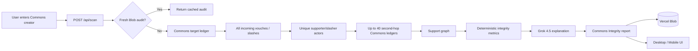

# VouchGuard AI

> **Audit the Commons leaderboard.** See whether a creator’s rank appears to be supported organically or depends on reciprocal, concentrated, or coordinated vouch networks.

VouchGuard AI is a responsive Next.js application for **Commons Made leaderboard integrity analysis**.

The product no longer tries to decide creator authenticity from a small X-post sample. Instead it starts from the data that actually moved the Commons score:

1. Load the creator’s Commons ledger.
2. Retrieve **all incoming vouches and slashes** recorded for that target.
3. Load a bounded set of second-hop supporter ledgers.
4. Reconstruct supporter-to-supporter vouch relationships.
5. Measure reciprocity, clustering, point concentration and timing concentration deterministically.
6. Compute a **Commons Integrity Score** and component risk metrics.
7. Send the already-computed graph facts to **Grok 4.5** for a human-readable verdict.

The normal audit does **not require paid X API reads**.

---

## What the product answers

For an input such as:

```text
@natalia77351991
```

VouchGuard answers questions such as:

- How many accounts vouched for this creator?
- Who slashed them?
- How much did each account move the score?
- Did the creator vouch back their supporters?
- Do the supporters heavily vouch one another?
- Is most support concentrated in one connected cluster?
- Did many vouches arrive in a short synchronized burst?
- Does one account or a small handful dominate the point impact?
- Does the observed support network look **organic, mixed, or highly coordinated**?

The headline is **Commons Integrity**, not “Vouch Confidence”.

---

# Core metrics

VouchGuard exposes:

- **Commons Integrity** — overall integrity score after a graph-coverage penalty.
- **Organic Support** — how independent/diverse the observed support appears.
- **Coordination Risk** — closed-cluster + reciprocity + timing + concentration risk.
- **Reciprocity Risk** — how much incoming support appears to have been vouched back by the target.
- **Concentration Risk** — whether a small number of accounts dominate point impact.
- **Timing Risk** — unusually compressed 15-minute / 60-minute vouch bursts.
- **Low-quality Support Risk** — thinly supported, low-power voucher accounts relative to the observed supporter set.
- **Bot/Sybil Support Risk** — a combined behavioral-network risk indicator.

**Important:** Bot/Sybil Support Risk is not proof that accounts are automated or share one owner. It is a coordination-risk label derived from public Commons relationships.

---

# Product workflow



## System overview

```mermaid
graph TB
  subgraph Browser[Desktop / Mobile Browser]
    HOME[Creator Auditor]
    REPORT[Integrity Report]
    PUBLIC[Public /u/:handle Audit]
  end

  subgraph Vercel[Next.js on Vercel]
    AUDIT[/api/scan]
    HEALTH[/api/health]
    RATE[Rate Limiter]
    COMMONS[Commons Adapter]
    GRAPH[Graph / Statistics Engine]
    GROKREPORT[Grok Report Layer]
    BLOB[Vercel Blob Cache]
  end

  subgraph Commons[Commons Made]
    TARGET[/targets/:handle/ledger]
    SECONDHOP[Supporter Ledgers]
  end

  subgraph xAI[xAI]
    GROK[Grok 4.5]
  end

  HOME --> AUDIT
  AUDIT --> RATE
  AUDIT --> BLOB
  AUDIT --> COMMONS
  COMMONS --> TARGET
  TARGET --> SECONDHOP
  SECONDHOP --> GRAPH
  GRAPH --> GROKREPORT
  GROKREPORT --> GROK
  GROK --> REPORT
  REPORT --> BLOB
  BLOB --> PUBLIC
  HEALTH --> HOME
```

---

# Commons data source

VouchGuard uses the per-target Commons genesis ledger endpoint:

```text
https://api.commonsmade.com/game/events/genesis/targets/<HANDLE>/ledger
```

The ledger exposes the fields needed for integrity analysis, including incoming action type, author handle, point impact, source post and timestamp.

A normalized event looks like:

```json
{
  "kind": "vouch",
  "authorHandle": "alice",
  "points": 42100,
  "tweetUrl": "https://x.com/...",
  "createdAt": "2026-08-23T..."
}
```

The target ledger is always read in full. Second-hop supporter inspection is capped at **40 unique actors** to keep latency and Commons API load bounded. High-impact vouchers are prioritized.

If a target has more than 40 voucher/slasher actors, the UI still shows the complete target ledger, while graph coverage reflects the second-hop sample.

---

# How the graph is reconstructed

Suppose the target is vouched by:

```text
Alice → Target
Bob   → Target
Carol → Target
```

VouchGuard then loads Alice, Bob and Carol’s own target ledgers.

If Bob appears as an incoming voucher in Alice’s ledger, we know:

```text
Bob → Alice
```

If the original target appears in Alice’s ledger, we know the relationship is reciprocal:

```text
Alice → Target
Target → Alice
```

This lets VouchGuard reconstruct observable Commons relationships without scraping X posts.

The graph engine measures:

- unique vouchers/slashers;
- reciprocal-vouch ratio;
- internal supporter vouch edges;
- largest connected supporter component;
- internal edge density;
- top-1 and top-5 point concentration;
- point HHI concentration;
- maximum vouches in a 15-minute window;
- maximum vouches in a 60-minute window;
- approximate voucher base power from Commons vouch impact;
- thin/low-power supporter share;
- graph coverage.

---

# Deterministic scoring

Numeric scores are produced in `lib/integrity.ts`, not by Grok.

The strongest coordination signal is a combination of:

```text
closed supporter component
+ internal supporter vouches
+ target reciprocity
+ compressed timing
+ point concentration
```

No single feature is treated as proof of manipulation.

Examples:

- **Reciprocity alone** may simply represent friends/builders supporting each other.
- **High point concentration alone** may mean one respected creator has large vouch power.
- A **dense closed cluster + high reciprocity + synchronized timing** is much more informative.

Graph coverage is applied as a confidence/integrity penalty when second-hop Commons ledgers cannot be loaded.

Current methodology version:

```text
vg-commons-2026.08.1
```

---

# Grok 4.5 role

Grok is intentionally **not the crawler and not the numeric judge**.

Grok receives structured facts such as:

```json
{
  "rank": 327,
  "metrics": {
    "integrityScore": 84,
    "organicSupport": 88,
    "coordinationRisk": 19,
    "reciprocityRisk": 12
  },
  "stats": {
    "uniqueVouchers": 17,
    "largestComponentShare": 0.18,
    "reciprocalVoucherRatio": 0.12,
    "maxVouches15m": 2
  },
  "supporters": []
}
```

It returns a strict structured report:

```text
LIKELY_ORGANIC
MIXED
HIGH_COORDINATION_RISK
INSUFFICIENT_DATA
```

plus:

- headline;
- explanation;
- organic signals;
- risk signals;
- caveats;
- confidence.

If xAI is unavailable, VouchGuard falls back to a deterministic text report from the same graph metrics rather than failing the audit.

---

# UI / UX

The main page has one task:

```text
@creator → Audit creator
```

The report includes:

- creator Commons rank;
- total Commons points;
- Commons Integrity score;
- Organic Support;
- Coordination Risk;
- Reciprocity Risk;
- Bot/Sybil Support Risk;
- vouch/slash totals;
- second-hop graph coverage;
- largest support cluster;
- concentration/timing statistics;
- deterministic evidence cards;
- Grok verdict;
- supporter table;
- original incoming Commons ledger;
- public shareable `/u/<handle>` page.

The interface is responsive for desktop and phone viewports. Wide supporter tables stay inside a horizontally scrollable container rather than overflowing the page.

---

# Project structure

```text
app/
  api/
    health/route.ts
    scan/route.ts
  methodology/page.tsx
  u/[handle]/page.tsx
  globals.css
  integrity.css
  layout.tsx
  page.tsx

components/
  Scanner.tsx
  ResultPanel.tsx

lib/
  audit.ts                 audit orchestrator
  commons.ts               Commons target-ledger adapter
  integrity.ts             graph + deterministic metrics
  integrity-types.ts       integrity domain model
  grok-integrity.ts        bounded Grok report layer
  storage.ts               Vercel Blob cache
  rate-limit.ts
  utils.ts

sdk/
  index.ts

tests/
  integrity.test.ts
  scoring.test.ts          legacy scorer regression tests
  handle.test.ts

e2e/
  ui.spec.ts

scripts/
  e2e-simulate.mjs
```

Legacy X-account-analysis modules remain in the repo for possible future **optional deep creator checks**, but they are not used by the normal Commons integrity audit.

---

# Environment variables

| Variable | Required | Purpose |
|---|---:|---|
| `XAI_API_KEY` | Recommended | Grok integrity explanation/verdict |
| `XAI_MODEL` | No | Defaults to `grok-4.5-latest` |
| `BLOB_READ_WRITE_TOKEN` | Recommended | Durable audit cache/public pages |
| `SCAN_CACHE_TTL_SECONDS` | No | Defaults to `21600` (6 h) |
| `SCAN_RATE_LIMIT_PER_MINUTE` | No | Defaults to `12` |
| `VOUCHGUARD_DEMO_MODE` | No | Synthetic graph mode for tests |
| `NEXT_PUBLIC_APP_URL` | Recommended | Canonical public origin |
| `X_BEARER_TOKEN` | No | Reserved for future optional deep X checks |

Normal production audits use **Commons + Grok**, not the X API.

---

# Local development

Requirements:

```text
Node.js 22.x
npm
```

Install:

```bash
npm install
cp .env.example .env.local
npm run dev
```

Demo mode uses synthetic Commons graphs and makes no Commons/xAI calls:

```bash
VOUCHGUARD_DEMO_MODE=true npm run dev
```

Useful handles:

```text
alice_builder       → organic synthetic graph
organic_creator     → organic synthetic graph
bot_swarm_01        → closed reciprocal synthetic ring
```

---

# API

## `POST /api/scan`

Request:

```json
{
  "handle": "natalia77351991",
  "refresh": false
}
```

Representative response:

```json
{
  "handle": "natalia77351991",
  "commons": {
    "rank": 742,
    "totalPoints": 188000
  },
  "metrics": {
    "integrityScore": 86,
    "organicSupport": 90,
    "coordinationRisk": 14,
    "reciprocityRisk": 9,
    "concentrationRisk": 18,
    "timingRisk": 7,
    "lowQualitySupportRisk": 8,
    "botSybilSupportRisk": 12
  },
  "stats": {
    "uniqueVouchers": 14,
    "graphCoverage": 1,
    "reciprocalVoucherRatio": 0.07,
    "largestComponentShare": 0.14
  },
  "report": {
    "verdict": "LIKELY_ORGANIC"
  }
}
```

## `GET /api/health`

Healthy production response:

```json
{
  "ok": true,
  "mode": "live",
  "model": "grok-4.5-latest",
  "xaiConfigured": true,
  "primaryData": "commons-ledger",
  "xApiRequired": false,
  "storage": "vercel-blob",
  "methodologyVersion": "vg-commons-2026.08.1"
}
```

---

# TypeScript SDK

```ts
import { VouchGuardClient } from "./sdk/index";

const guard = new VouchGuardClient({
  baseUrl: "https://vouchguard-ai.vercel.app",
});

const audit = await guard.auditCreator("natalia77351991");

console.log(audit.metrics.integrityScore);
console.log(audit.metrics.coordinationRisk);
console.log(audit.report.verdict);
```

For backwards compatibility, `scanAccount()` aliases `auditCreator()`.

---

# Testing

Standard validation:

```bash
npm run typecheck
npm test
npm run build
npm run test:e2e
```

Browser QA:

```bash
npx playwright install chromium
npm run test:ui
```

The browser suite verifies:

- desktop creator audit flow;
- mobile creator audit flow;
- no horizontal page overflow;
- supporter table containment/scrolling;
- integrity metrics/result rendering;
- methodology page phone layout.

Unit tests include two graph fixtures:

- independent supporters → strong organic score;
- closed reciprocal ring → high coordination risk.

---

# Vercel deployment

Recommended production environment:

```text
XAI_API_KEY=<secret>
XAI_MODEL=grok-4.5-latest
SCAN_CACHE_TTL_SECONDS=21600
SCAN_RATE_LIMIT_PER_MINUTE=12
VOUCHGUARD_DEMO_MODE=false
NEXT_PUBLIC_APP_URL=https://vouchguard-ai.vercel.app
```

Connect a Vercel Blob store from **Project → Storage** so Vercel injects `BLOB_READ_WRITE_TOKEN`.

`X_BEARER_TOKEN` is not required for this architecture.

After deployment verify:

```text
https://vouchguard-ai.vercel.app/
https://vouchguard-ai.vercel.app/api/health
```

Then force one real Commons audit and confirm:

- the creator rank/points are populated;
- all incoming target ledger events are shown;
- supporter graph coverage is non-zero;
- the report contains a Commons Integrity score;
- the public `/u/<handle>` audit survives reload.

---

# Safety / interpretation

VouchGuard is an **integrity and coordination analysis tool**, not an identity oracle.

It does not claim that:

- a given account is definitively a bot;
- several accounts belong to one person;
- reciprocal vouching is automatically abusive;
- concentrated support is automatically fraudulent.

The application reports observable Commons graph structure and a probabilistic interpretation. Users should inspect the supporter table, source ledger and caveats before drawing conclusions.
