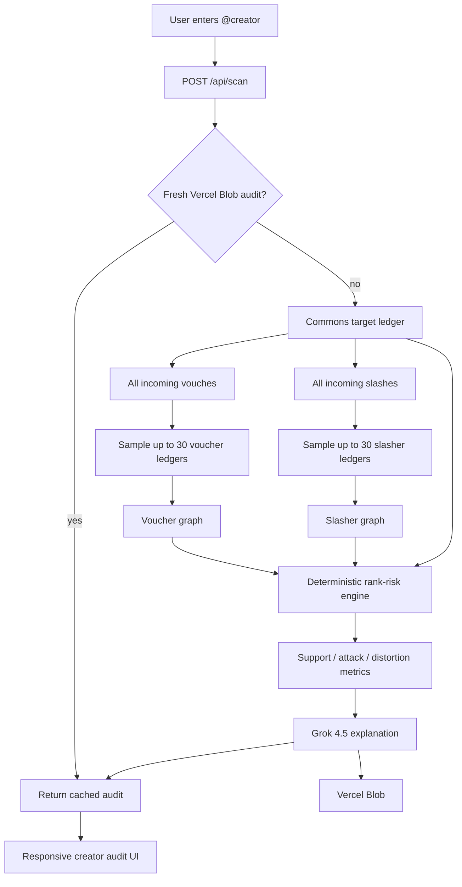
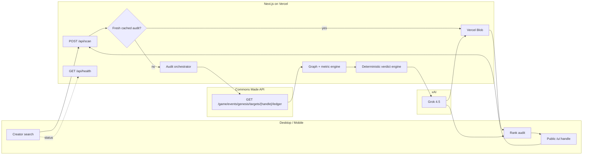

# VouchGuard AI

> **Audit the Commons leaderboard.** See how a creator’s rank was built — and whether incoming vouches or incoming slashes may have distorted it.

**Live:** https://vouchguard-ai.vercel.app

VouchGuard AI is a responsive Next.js application for **Commons Made leaderboard integrity analysis**.

The product starts from the data that actually changes Commons scores: the creator’s **incoming vouch/slash ledger**. It reconstructs positive-support and negative-attack networks separately, computes deterministic graph statistics, and then uses **Grok 4.5** to explain the measured evidence.

Current methodology: **`vg-commons-2026.08.3`**

---

## The problem

A single “this creator looks organic” score is not enough for Commons.

An account can simultaneously have:

- legitimate, diverse incoming vouches;
- a leaderboard position that is highly dependent on incoming support;
- hundreds of incoming slashes;
- a possible coordinated slasher cluster;
- coordinated positive support;
- or coordinated support and coordinated attacks at the same time.

VouchGuard therefore does **not** collapse everything into one authenticity number.

The v3 model answers two independent questions.

### 1. Support Integrity

> Does the incoming **VOUCH** network look diverse and natural, or reciprocal, concentrated, or coordinated?

### 2. Slash Attack Risk

> Has the rank been materially hit by **SLASH** actions, and does the sampled slasher network show timing or graph patterns consistent with coordination?

Heavy slashing is **not automatically called a bot attack**. VouchGuard separates **attack pressure** from **attack coordination**.

---

## Main output

A creator report exposes:

- **Support Integrity** — positive-support quality, 0–100, higher is better.
- **Slash Attack Risk** — combined slash pressure + attack coordination, 0–100, higher is riskier.
- **Support Coordination Risk** — reciprocity, supporter components, timing, concentration, and thin-account signals.
- **Attack Pressure** — how materially slashes affected the account regardless of who controlled the slashers.
- **Attack Coordination Risk** — timing + sampled slasher-network relationships + thin-account/context signals.
- **Bot/Sybil Network Risk** — conservative behavioral graph suspicion; never proof of shared ownership or automation.
- **Rank Distortion Risk** — estimated risk that the observed leaderboard position was strongly driven or distorted by coordinated support or heavy slashing.
- **Rank Reliability** — `100 − Rank Distortion Risk`.

The report also shows the incoming Commons ledger, top vouchers, top slashers, graph coverage, timing bursts, point concentration, and Grok’s separate support/attack interpretation.

---

## Verdicts

VouchGuard currently uses these deterministic verdict states:

```text
LIKELY_ORGANIC
SUPPORT_REVIEW
SUPPORT_COORDINATION_RISK
HEAVY_SLASH_PRESSURE
SLASH_ATTACK_RISK
CONTESTED_MANIPULATION
INSUFFICIENT_DATA
```

### `LIKELY_ORGANIC`

Observed positive support looks healthy, graph coverage is adequate for the verdict, and there is no major slash-attack signal.

### `SUPPORT_REVIEW`

Positive support cannot safely receive a strong organic verdict. One example is a rank that is highly dependent on incoming vouches while only a small part of the voucher graph has been inspected.

### `SUPPORT_COORDINATION_RISK`

The positive VOUCH network itself contains strong coordination indicators.

### `HEAVY_SLASH_PRESSURE`

The rank was heavily affected by negative actions, but available graph evidence is not sufficient to classify the slash wave as a coordinated attack.

### `SLASH_ATTACK_RISK`

Heavy slash pressure is accompanied by stronger timing, connected-network, or thin-account evidence and sufficient slasher-graph coverage for the deterministic threshold.

### `CONTESTED_MANIPULATION`

Both the positive supporter network and the negative slasher side contain strong risk signals.

### `INSUFFICIENT_DATA`

Too little Commons ledger evidence exists for a meaningful result.

---

# Architecture



## System overview



The two diagrams intentionally distinguish **data acquisition**, **deterministic scoring**, and **LLM explanation**. Grok does not own the numeric scores or the controlling verdict.

---

# Commons data source

The core endpoint used by the application is:

```text
GET https://api.commonsmade.com/game/events/genesis/targets/{handle}/ledger
```

VouchGuard normalizes each ledger entry into:

```ts
interface CommonsLedgerEntry {
  kind: "vouch" | "slash";
  authorHandle: string;
  authorAvatarUrl: string | null;
  points: number;
  tweetText: string;
  tweetUrl: string | null;
  createdAt: string | null;
}
```

The target ledger supplies the incoming actions observed for the creator. To reconstruct second-hop relationships, VouchGuard loads ledgers for selected vouchers and slashers.

There is no assumption that an incoming slash means the target did something wrong, or that a large slash wave automatically means bots.

---

# Independent second-hop sampling

This is critical to v3.

Older versions used one shared second-hop quota. A heavily-vouched creator could consume every graph slot, leaving **zero slasher ledgers inspected** even after hundreds of incoming slashes.

v3 uses separate budgets:

```text
up to 30 voucher ledgers
+
up to 30 slasher ledgers
```

Each side uses a mixed strategy:

```text
~60% highest-impact actors
+
remaining slots from most-recent actors
```

This lets the graph inspect both:

- accounts that moved the score most;
- accounts involved in recent timing bursts.

If the same actor appears on both sides, the union prevents duplicate second-hop fetches.

---

# Support Integrity

The positive-support engine considers:

- number of unique vouchers;
- total vouch points;
- target ↔ voucher reciprocity;
- positive links among voucher accounts;
- largest connected voucher component;
- observed positive edges per sampled voucher;
- top-1 / top-5 point concentration;
- HHI concentration;
- vouch timing bursts;
- thin, low-power sampled vouchers;
- voucher graph coverage.

A large connected component can matter even when global graph density appears small, because only a subset of the full supporter graph is sampled.

---

# Slash Attack Risk

The negative side is analyzed independently from positive support.

## Attack Pressure

Attack Pressure measures how strongly slashes changed the observed leaderboard position using:

- unique slasher count;
- total slash points;
- negative action share;
- slash impact relative to the estimated pre-ledger/base contribution.

High pressure means **the rank was heavily affected**. It does not establish bot ownership or shared control.

## Attack Coordination Risk

Attack Coordination Risk considers:

- 5-minute slash bursts;
- 15-minute slash bursts;
- 60-minute slash bursts;
- positive links among sampled slasher accounts;
- largest connected slasher component;
- slash-point concentration;
- thin-account context;
- slasher graph coverage.

The application also records internal slash links among sampled slashers for inspection, while the current connected-component calculation is based on observed positive relationships inside the slasher set.

If pressure is high but graph coverage is low, VouchGuard prefers `HEAVY_SLASH_PRESSURE` rather than pretending coordination was proven or disproven.

---

# Rank dependence and distortion

VouchGuard derives context from the observed ledger:

```text
Net Ledger Impact
  = Vouch Points − Slash Points

Estimated Pre-Ledger/Base Contribution
  = Current Commons Total − Net Ledger Impact
```

This is an **estimate from observed ledger arithmetic**, not an official Commons base-score field.

For positive totals:

```text
Estimated Net Support Share
  = max(Net Ledger Impact, 0) / Current Total
```

A 90% support share does **not** mean manipulation. It means the current positive total depends heavily on incoming support, so stronger graph coverage is required before calling that rank organically supported.

`Rank Distortion Risk` uses the stronger of:

- suspicious positive-support influence weighted by support dependence;
- negative slash pressure weighted by how dominant negative actions are.

`Rank Reliability` is the inverse presentation:

```text
Rank Reliability = 100 − Rank Distortion Risk
```

---

# Grok 4.5

Grok is **not the scoring engine**.

The TypeScript application computes all numeric metrics and the controlling deterministic verdict first. Grok then receives:

- target rank and total points;
- deterministic metrics;
- network statistics;
- sampled voucher rows;
- sampled slasher rows;
- evidence objects.

Grok returns:

```text
headline
explanation
supportAssessment
attackAssessment
organicSignals[]
supportRiskSignals[]
attackRiskSignals[]
caveats[]
confidence
```

The application overwrites any model-produced verdict with the deterministic verdict before returning the report, so the LLM cannot silently change the classification.

The prompt explicitly instructs Grok that:

- heavy slashing is not proof of bots;
- low slasher coverage means coordination is unresolved, not absent;
- Bot/Sybil Network Risk is probabilistic;
- reciprocity alone is not abuse;
- high support dependence can simply mean popularity;
- external facts not present in the supplied Commons graph must not be invented.

If xAI is unavailable or times out, VouchGuard falls back to a deterministic explanation instead of dropping the audit.

---

# Project structure

```text
app/
  api/
    health/route.ts
    scan/route.ts
  methodology/page.tsx
  u/[handle]/page.tsx
  globals.css
  integrity.css
  layout.tsx
  page.tsx

components/
  Scanner.tsx
  ResultPanel.tsx

lib/
  audit.ts
  commons.ts
  grok-integrity.ts
  integrity.ts
  integrity-types.ts
  verdict.ts
  rate-limit.ts
  storage.ts
  utils.ts

sdk/
  index.ts

e2e/
  ui.spec.ts

tests/
  integrity.test.ts
  ...

.github/workflows/
  ci.yml
  live-production.yml
  deploy-vercel.yml
```

---

# Environment variables

The core Commons audit does **not require an X API Bearer Token**.

```env
# Required for Grok explanations in production.
XAI_API_KEY=

# Optional model override.
XAI_MODEL=grok-4.5-latest

# Created when Vercel Blob is connected.
BLOB_READ_WRITE_TOKEN=

# Default: 6 hour audit cache.
SCAN_CACHE_TTL_SECONDS=21600

# Per-instance rate limiter.
SCAN_RATE_LIMIT_PER_MINUTE=12

# Must be false in production.
VOUCHGUARD_DEMO_MODE=false

# Canonical deployment URL.
NEXT_PUBLIC_APP_URL=https://vouchguard-ai.vercel.app
```

---

# Local development

Requirements:

```text
Node.js 22.x
npm
```

Install and run:

```bash
npm install
cp .env.example .env.local
npm run dev
```

Open:

```text
http://localhost:3000
```

## Demo mode

No Commons or xAI calls are required for synthetic UI testing:

```bash
VOUCHGUARD_DEMO_MODE=true npm run dev
```

Useful demo handles:

```text
alice_builder
organic_creator
bot_swarm_01
attacked_victim
```

`attacked_victim` is specifically a regression scenario for:

> clean/independent positive support + a mass slash wave

It must never receive a blanket `LIKELY_ORGANIC` verdict.

---

# API

## `POST /api/scan`

Request:

```json
{
  "handle": "cryptokaai",
  "refresh": true
}
```

Representative response shape:

```json
{
  "handle": "Cryptokaai",
  "methodologyVersion": "vg-commons-2026.08.3",
  "commons": {
    "rank": 94290,
    "totalPoints": -428977
  },
  "metrics": {
    "supportIntegrity": 74,
    "supportCoordinationRisk": 2,
    "slashAttackRisk": 81,
    "attackPressure": 93,
    "attackCoordinationRisk": 66,
    "botSybilNetworkRisk": 41,
    "rankDistortionRisk": 74,
    "rankReliability": 26
  },
  "stats": {
    "uniqueVouchers": 238,
    "uniqueSlashers": 175,
    "vouchPoints": 2748321,
    "slashPoints": 3180298,
    "vouchGraphCoverage": 0.126,
    "slashGraphCoverage": 0.171
  },
  "report": {
    "verdict": "HEAVY_SLASH_PRESSURE"
  }
}
```

The values above are only a **snapshot example**. Commons ledger data changes over time, so ranks, points, risks, and verdicts can change on refresh.

## `GET /api/health`

Expected production shape:

```json
{
  "ok": true,
  "mode": "live",
  "model": "grok-4.5-latest",
  "xaiConfigured": true,
  "primaryData": "commons-ledger",
  "xApiRequired": false,
  "storage": "vercel-blob",
  "methodologyVersion": "vg-commons-2026.08.3"
}
```

---

# TypeScript SDK

```ts
import { VouchGuardClient } from "./sdk/index";

const guard = new VouchGuardClient({
  baseUrl: "https://vouchguard-ai.vercel.app",
});

const audit = await guard.auditCreator("cryptokaai", { refresh: true });

console.log(audit.metrics.supportIntegrity);
console.log(audit.metrics.slashAttackRisk);
console.log(audit.metrics.rankReliability);
console.log(audit.report.verdict);
```

---

# Tests

## Static / unit / build

```bash
npm run typecheck
npm test
npm run build
```

The integrity suite includes regressions for:

- independent organic-looking supporter networks;
- reciprocal voucher rings;
- rank-dependence arithmetic;
- slash-adjusted net support;
- organic vouches + mass slashing;
- independent voucher and slasher graph construction.

## Production-server E2E simulation

```bash
npm run test:e2e
```

## Desktop + mobile UI QA

```bash
npx playwright install chromium
npm run test:ui
```

The browser suite checks:

- 1440px desktop report;
- 390px phone report;
- 360px table containment;
- no page-level horizontal overflow;
- support + attack sections;
- attack-victim verdict UX;
- methodology mobile readability.

## Live production validation

Use GitHub Actions → **Live Production Validation**.

It verifies:

- public production URL;
- `/api/health`;
- methodology version;
- live Commons audit;
- required dual-axis metrics;
- voucher/slasher graph statistics;
- Grok support and attack explanations.

---

# Vercel

Production target:

```text
https://vouchguard-ai.vercel.app
```

The current v3 implementation uses standard Next.js server routes and Vercel Blob. No separate relational or graph database is required for the current deployment.

Do not expose `XAI_API_KEY` or `BLOB_READ_WRITE_TOKEN` in browser-side environment variables.

---

# Interpretation and safety

VouchGuard is an **integrity / anomaly decision-support system**, not an accusation engine.

It can report:

```text
heavy slash pressure
support coordination risk
slash attack risk
Bot/Sybil network risk
rank distortion risk
```

It should not state as established fact:

```text
this person used bots
these accounts share one owner
this creator is a scammer
this slasher is a Sybil
```

Those claims require evidence that Commons ledger graph structure alone does not establish.

The purpose of the product is to make the structure visible so users and the Commons team can investigate the right accounts and clusters.

---

## License

Add the license that matches the intended public distribution model before final public release.
