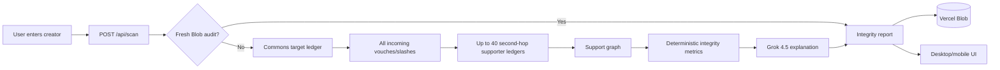

# VouchGuard AI

> **Audit the Commons leaderboard.** See how a creator’s rank was built and whether observed support looks organic, reciprocal, concentrated, or coordinated.

VouchGuard AI is a responsive Next.js application for **Commons Made leaderboard integrity analysis**.

The normal product does **not** judge a creator from a handful of X posts and does **not** require paid X API reads. It starts with the data that actually changed the Commons score: the creator’s Commons vouch/slash ledger.

## What VouchGuard does

For an input such as:

```text
@natalia77351991
```

VouchGuard:

1. Loads the complete incoming Commons ledger for the creator.
2. Extracts every voucher/slasher, point impact, timestamp and source URL supplied by Commons.
3. Loads up to 40 high-impact supporter/slasher ledgers for second-hop analysis.
4. Reconstructs observable supporter-to-supporter and target↔supporter relationships.
5. Measures reciprocity, connected clusters, point concentration, timing concentration and thin-support patterns.
6. Estimates how much of the current Commons score came from net incoming ledger support.
7. Computes deterministic integrity/risk metrics in application code.
8. Sends those structured facts to **Grok 4.5** for a cautious human-readable verdict.
9. Stores the finished audit in Vercel Blob for fast public `/u/<handle>` pages.

The headline metric is **Commons Integrity**.

---

## Product output

A creator audit exposes:

- **Commons Integrity** — overall integrity of the observed support network.
- **Organic Support** — how independent/diverse the observed support appears.
- **Coordination Risk** — closed-cluster, reciprocity, timing and concentration risk.
- **Reciprocity Risk** — how much incoming support appears to have been vouched back by the target.
- **Bot/Sybil Support Risk** — a behavioral-network risk indicator, not proof of shared ownership or automation.
- **Net Ledger Impact** — vouch points minus slash points.
- **Estimated Pre-ledger/Base Contribution** — current total minus observed net ledger impact.
- **Estimated Net Support Share** — approximate portion of the current total attributable to positive net incoming support.
- all incoming vouchers/slashes;
- supporter graph coverage;
- supporter-to-supporter internal edges;
- largest supporter component;
- top-1/top-5 point concentration;
- 15-minute and 60-minute vouch bursts;
- supporter Commons rank/points when available;
- Grok verdict, organic signals, risk signals and caveats.

**Support dependence is context, not guilt.** A creator can receive most of their score from vouches and still have a healthy, independent support network.

---

# Architecture



## System overview

```mermaid
graph TB
  subgraph Browser[Desktop / Mobile]
    HOME[Creator Auditor]
    REPORT[Integrity Report]
    PUBLIC[Public /u/:handle audit]
  end

  subgraph Vercel[Next.js]
    SCAN[/api/scan]
    HEALTH[/api/health]
    RATE[Rate limiter]
    ADAPTER[Commons adapter]
    GRAPH[Graph/statistics engine]
    GROKREPORT[Grok report layer]
    STORE[Vercel Blob]
  end

  subgraph Commons[Commons Made API]
    TARGET[/targets/:handle/ledger]
    SUPPORTERS[Supporter ledgers]
  end

  subgraph xAI[xAI]
    GROK[Grok 4.5]
  end

  HOME --> SCAN
  SCAN --> RATE
  SCAN --> STORE
  SCAN --> ADAPTER
  ADAPTER --> TARGET
  TARGET --> SUPPORTERS
  SUPPORTERS --> GRAPH
  GRAPH --> GROKREPORT
  GROKREPORT --> GROK
  GROK --> REPORT
  REPORT --> STORE
  STORE --> PUBLIC
  HEALTH --> HOME
```

---

# Commons data source

VouchGuard uses the public per-target Genesis ledger:

```text
GET https://api.commonsmade.com/game/events/genesis/targets/{handle}/ledger
```

The normalized target data contains:

```ts
{
  handle,
  display,
  rank,
  totalPoints,
  entries: [
    {
      kind: "vouch" | "slash",
      authorHandle,
      authorAvatarUrl,
      points,
      tweetText,
      tweetUrl,
      createdAt
    }
  ]
}
```

The target ledger is read in full. Second-hop inspection is bounded to 40 high-priority actors to keep latency/API load controlled; vouchers are prioritized, then actors are ordered by absolute point impact. The report shows second-hop **graph coverage** so partial analysis is visible.

---

# How the graph is reconstructed

Suppose Commons records:

```text
Alice → Target
Bob   → Target
Carol → Target
```

If Bob appears as an incoming voucher in Alice’s own target ledger, VouchGuard observes:

```text
Bob → Alice
```

If Target appears as an incoming voucher in Alice’s ledger, then the target/supporter relationship is reciprocal:

```text
Alice  → Target
Target → Alice
```

From these observed edges the engine calculates connected components, internal edge density, reciprocity and cluster concentration.

No hidden device/IP data is used.

---

# Rank-dependence context

Methodology **`vg-commons-2026.08.2`** adds explicit analysis of how much the current rank appears to rely on incoming support.

```text
Net Ledger Impact = Vouch Points − Slash Points

Estimated Pre-ledger/Base Contribution =
  Current Commons Total − Net Ledger Impact

Estimated Net Support Share =
  max(0, Net Ledger Impact) / Current Commons Total
```

The support share is capped to 0–100% in the UI.

These values are labelled **estimated** because they are reconstructed from the current Commons total and the observed ledger; they are not presented as official Commons base-score fields.

They do **not** directly raise Coordination Risk. Their job is to answer a separate question:

> Did this creator mainly bring a strong underlying score into the leaderboard, or is the current score heavily dependent on incoming vouch support?

---

# Deterministic graph metrics

Implemented in `lib/integrity.ts`.

### Support structure

- incoming vouch/slash count;
- unique vouchers/slashers;
- vouch/slash points;
- net ledger impact;
- estimated base/support share;
- graph coverage.

### Reciprocity

- number/share of vouchers whose own ledger contains a target→supporter vouch.

### Coordination

- internal supporter vouch edges;
- internal slash edges;
- largest connected supporter component;
- largest-component share;
- internal directed-edge density.

### Concentration

- top supporter point share;
- top five point share;
- HHI of incoming vouch power.

### Timing

- maximum vouches in any 15-minute window;
- maximum vouches in any 60-minute window;
- burst share of all incoming vouches.

### Thin-support context

For each voucher, action impact is converted into an approximate base-power context using the campaign’s ~35% vouch-power relationship. A voucher is only treated as “thin/low-power” when it is both far below the observed supporter median and has very little incoming Commons support in the loaded graph.

No single feature proves manipulation.

---

# Scoring philosophy

Strong coordination evidence should usually require a **combination** such as:

```text
large closed supporter component
+ high internal edge density
+ high target reciprocity
+ compressed timing
+ concentrated point impact
```

Examples:

- Reciprocity alone can be normal between builders/friends.
- One large vouch can come from a legitimate high-reputation creator.
- A high net support share only means the score is support-dependent; it does not mean the support is suspicious.
- Dense reciprocal supporter rings plus synchronized action timing are more concerning than any one signal alone.

The current numeric metrics are:

```text
integrityScore
organicSupport
coordinationRisk
reciprocityRisk
concentrationRisk
timingRisk
lowQualitySupportRisk
botSybilSupportRisk
```

If too little support exists for a meaningful network judgement, Grok/deterministic verdict becomes `INSUFFICIENT_DATA` and the UI suppresses headline/component numbers rather than presenting sparse evidence as certainty.

---

# Grok 4.5 role

Grok is **not the crawler** and **not the numeric scorer**.

It receives structured Commons facts already calculated by VouchGuard, for example:

```json
{
  "rank": 327,
  "totalPoints": 284920,
  "metrics": {
    "integrityScore": 84,
    "organicSupport": 88,
    "coordinationRisk": 19,
    "reciprocityRisk": 12
  },
  "stats": {
    "uniqueVouchers": 17,
    "estimatedNetSupportShare": 0.41,
    "largestComponentShare": 0.18,
    "reciprocalVoucherRatio": 0.12,
    "maxVouches15m": 2
  },
  "supporters": []
}
```

Grok uses `grok-4.5-latest`, low reasoning effort and strict structured output. It returns one cautious verdict:

```text
LIKELY_ORGANIC
MIXED
HIGH_COORDINATION_RISK
INSUFFICIENT_DATA
```

plus headline, explanation, organic signals, risk signals, caveats and confidence.

If xAI fails or `XAI_API_KEY` is absent, the audit still returns a deterministic fallback explanation from the same graph metrics.

---

# UI / UX

Homepage:

```text
COMMONS CREATOR
@username
[AUDIT CREATOR]
```

Main report:

- Commons rank / total points;
- Commons Integrity headline;
- Organic Support / Coordination / Reciprocity / Bot-Sybil Support Risk;
- net ledger impact;
- estimated pre-ledger/base contribution;
- estimated net support share;
- network statistics;
- deterministic evidence cards;
- Grok verdict;
- supporter table;
- original incoming Commons ledger;
- public share URL.

The supporter table remains horizontally scrollable inside its own container on phones and never forces page-wide overflow.

---

# Project structure

```text
app/
  api/
    health/route.ts
    scan/route.ts
  methodology/page.tsx
  u/[handle]/page.tsx
  globals.css
  integrity.css
  layout.tsx
  page.tsx

components/
  Scanner.tsx
  ResultPanel.tsx

lib/
  audit.ts
  commons.ts
  integrity.ts
  integrity-types.ts
  grok-integrity.ts
  storage.ts
  rate-limit.ts
  utils.ts

sdk/
  index.ts

tests/
  integrity.test.ts
  handle.test.ts
  scoring.test.ts

e2e/
  ui.spec.ts

scripts/
  e2e-simulate.mjs
```

Older X-account-analysis modules remain available for a future optional deep-X check, but they are not part of the normal Commons leaderboard audit.

---

# Environment variables

| Variable | Required | Purpose |
|---|---:|---|
| `XAI_API_KEY` | Recommended | Grok verdict/explanation |
| `XAI_MODEL` | No | Defaults to `grok-4.5-latest` |
| `BLOB_READ_WRITE_TOKEN` | Recommended | Durable audit cache/public pages |
| `SCAN_CACHE_TTL_SECONDS` | No | Defaults to `21600` (6h) |
| `SCAN_RATE_LIMIT_PER_MINUTE` | No | Defaults to `12` |
| `VOUCHGUARD_DEMO_MODE` | No | Synthetic graph mode |
| `NEXT_PUBLIC_APP_URL` | Recommended | Canonical share origin |
| `X_BEARER_TOKEN` | No | Reserved for optional future deep-X checks |

Recommended Vercel production settings:

```text
XAI_API_KEY=<secret>
XAI_MODEL=grok-4.5-latest
SCAN_CACHE_TTL_SECONDS=21600
SCAN_RATE_LIMIT_PER_MINUTE=12
VOUCHGUARD_DEMO_MODE=false
NEXT_PUBLIC_APP_URL=https://vouchguard-ai.vercel.app
```

Connect Vercel Blob through **Project → Storage** so `BLOB_READ_WRITE_TOKEN` is injected automatically.

---

# Local development

```bash
npm install
cp .env.example .env.local
npm run dev
```

Demo mode does not call Commons or xAI:

```bash
VOUCHGUARD_DEMO_MODE=true npm run dev
```

Useful demo handles:

```text
alice_builder     # independent synthetic support
organic_creator   # independent synthetic support
bot_swarm_01      # closed reciprocal ring
```

---

# API

## `POST /api/scan`

```json
{
  "handle": "natalia77351991",
  "refresh": false
}
```

Representative response shape:

```json
{
  "handle": "natalia77351991",
  "methodologyVersion": "vg-commons-2026.08.2",
  "commons": {
    "rank": 742,
    "totalPoints": 188000
  },
  "metrics": {
    "integrityScore": 86,
    "organicSupport": 90,
    "coordinationRisk": 14,
    "reciprocityRisk": 9,
    "botSybilSupportRisk": 12
  },
  "stats": {
    "uniqueVouchers": 14,
    "vouchPoints": 71000,
    "slashPoints": 5000,
    "netLedgerImpact": 66000,
    "estimatedTargetBasePoints": 122000,
    "estimatedNetSupportShare": 0.35,
    "graphCoverage": 1
  },
  "report": {
    "verdict": "LIKELY_ORGANIC"
  }
}
```

## `GET /api/health`

```json
{
  "ok": true,
  "mode": "live",
  "model": "grok-4.5-latest",
  "xaiConfigured": true,
  "primaryData": "commons-ledger",
  "xApiRequired": false,
  "storage": "vercel-blob",
  "methodologyVersion": "vg-commons-2026.08.2"
}
```

---

# SDK

```ts
import { VouchGuardClient } from "./sdk/index";

const guard = new VouchGuardClient({
  baseUrl: "https://vouchguard-ai.vercel.app",
});

const audit = await guard.auditCreator("natalia77351991");
console.log(audit.metrics.integrityScore);
console.log(audit.stats.estimatedNetSupportShare);
console.log(audit.report.verdict);
```

`scanAccount()` remains as a backwards-compatible alias for `auditCreator()`.

---

# Testing

Standard validation:

```bash
npm run typecheck
npm test
npm run build
npm run test:e2e
```

Browser QA:

```bash
npx playwright install chromium
npm run test:ui
```

CI checks:

- graph/unit tests;
- production Next.js build;
- organic and closed-ring synthetic E2E;
- desktop audit flow;
- 390px mobile audit flow;
- 360px supporter-table containment;
- page-wide horizontal overflow;
- methodology mobile layout.

The manual **Live Production Validation** GitHub workflow checks the real public app and performs a forced Commons audit.

---

# Deployment

Production target:

```text
https://vouchguard-ai.vercel.app
```

After each production deployment verify:

```text
/
/api/health
```

Then run a real audit and confirm:

- target Commons rank/total are populated;
- incoming target ledger events appear;
- second-hop graph coverage is visible;
- rank-dependence values are present;
- integrity metrics are numeric when data is sufficient;
- Grok/fallback verdict exists;
- `/u/<handle>` survives reload through Blob.

---

# Safety and interpretation

VouchGuard is an integrity-analysis tool, not an identity oracle.

It does **not** claim that:

- an account is definitively a bot;
- multiple accounts definitely share one owner;
- reciprocal support is automatically abusive;
- a high support share is manipulation;
- a concentrated vouch from a strong creator is automatically suspicious.

The application exposes observable Commons relationships and probabilistic network interpretation. Users should inspect the supporter table, source ledger, graph coverage and caveats before drawing conclusions.
