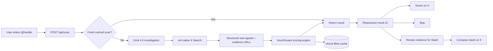
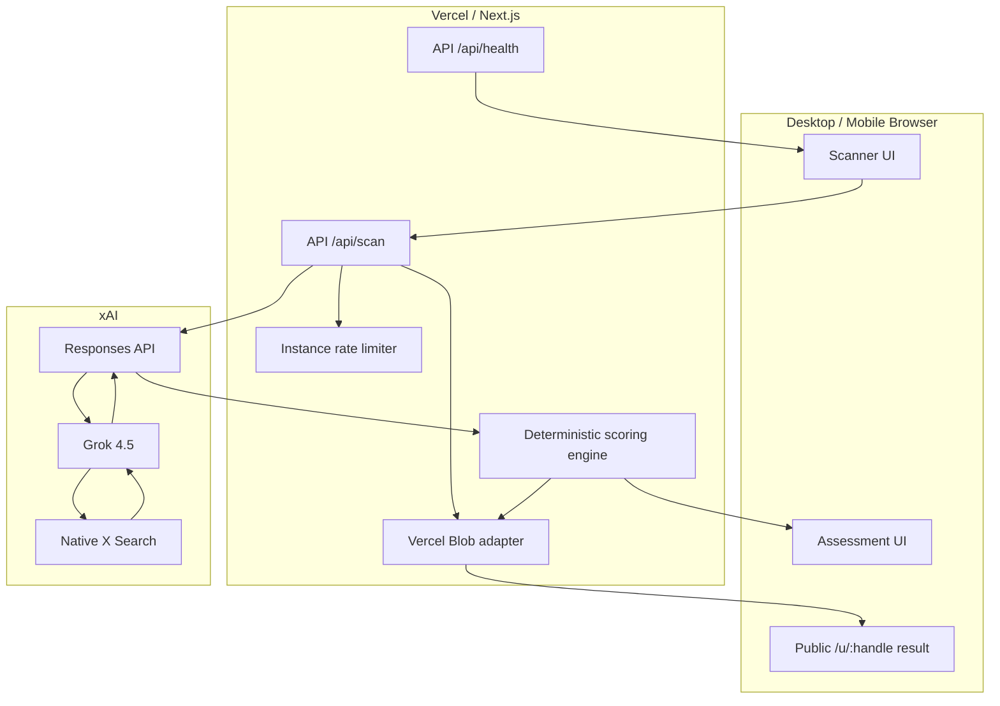

# VouchGuard AI

> **Scan before you vouch.** Account-level X intelligence for Commons vouch/slash decisions.

VouchGuard AI is a responsive Next.js web application that investigates an **entire public X account** before a user spends a scarce Commons action. It uses **Grok 4.5 + xAI native X Search** to inspect account history, content quality, reciprocal/campaign behavior, automation-like patterns and network coordination. The application then computes four independent, transparent metrics:

- **Authenticity** — evidence of a persistent, genuine identity and original activity.
- **Farmer Risk** — evidence that behavior is heavily optimized around campaigns, points, rewards, reciprocal support or vouch farming.
- **Bot Risk** — evidence of automation-like cadence, templating and mechanical interactions.
- **Sybil Risk** — evidence of coordinated/closed-cluster behavior. This is **not** a claim that one person owns multiple accounts.

A fifth number, **Vouch Confidence**, summarizes the decision context. The final action is always human-controlled: **Vouch**, **Skip**, or **Review for Slash**.

VouchGuard never posts to X automatically and never automatically slashes anyone.

---

## Why this product exists

Commons gives users powerful Vouch/Slash primitives, but a user still has to answer the hard question: **“What kind of account am I about to support or penalize?”**

Looking at one post is not enough. Crypto X contains huge volumes of repetitive campaign posts and required command syntax, so VouchGuard evaluates the **account-level behavioral pattern** instead.

The core design principle is:

```text
Grok investigates public X behavior
             ↓
Structured sub-signals + evidence
             ↓
Deterministic VouchGuard scoring
             ↓
Human reviews evidence
             ↓
Vouch / Skip / Review for Slash
```

---

## Product workflow



### System overview



---

## UI / UX

The homepage intentionally has one primary task: enter an X handle and scan it.

During a scan the UI exposes the investigation stages:

1. Resolve X identity
2. Read account history
3. Evaluate original content
4. Check farming patterns
5. Check automation signals
6. Investigate network coordination
7. Calculate VouchGuard scores

The result screen shows:

- Vouch Confidence
- Authenticity
- Farmer Risk
- Bot Risk
- Sybil Risk
- Model confidence
- Account history/activity summaries
- Evidence observations and public X source links
- Uncertainties
- Vouch / Skip / Review-for-Slash actions

### Slash safety UX

A high-risk result does **not** show “this person is a Sybil.” It shows probabilistic risk signals. Before the slash composer is enabled, the user must explicitly confirm that they reviewed the evidence.

This avoids turning an AI risk model into an automated accusation or pile-on mechanism.

---

## How account evaluation works

Grok does **not** return the final VouchGuard score. It returns structured sub-signals from 0–100:

### Positive sub-signals

- `contentOriginality`
- `identityContinuity`
- `engagementQuality`
- `socialDiversity`

### Risk sub-signals

- `campaignConcentration`
- `reciprocityPressure`
- `automationPattern`
- `temporalAnomalies`
- `networkCoordination`

The app then computes the public metrics in `lib/scoring.ts`.

### Current weights

```text
Authenticity =
  Originality × 26%
  + Continuity × 24%
  + Engagement × 18%
  + Diversity × 14%
  + (100 − Automation) × 10%
  + (100 − Campaign Concentration) × 8%

Farmer Risk =
  Campaign Concentration × 36%
  + Reciprocity × 28%
  + (100 − Originality) × 14%
  + (100 − Diversity) × 8%
  + Network Coordination × 14%

Bot Risk =
  Automation × 46%
  + Temporal Anomalies × 24%
  + (100 − Originality) × 14%
  + (100 − Engagement) × 16%

Sybil Risk =
  Network Coordination × 42%
  + (100 − Diversity) × 18%
  + Automation × 14%
  + Reciprocity × 16%
  + Campaign Concentration × 10%
```

See `/methodology` for the end-user explanation.

---

## Grok / xAI integration

The live scanner calls:

```http
POST https://api.x.ai/v1/responses
```

with:

- model: `grok-4.5-latest` by default
- tool: `x_search`
- 180-day analysis window
- strict JSON-schema structured output

The model is prompted to evaluate an account as a whole, not one Commons post. It may investigate recurring public counterparties when required to assess network coordination.

Relevant xAI documentation:

- https://docs.x.ai/developers/models/grok-4.5
- https://docs.x.ai/developers/tools/x-search
- https://docs.x.ai/developers/model-capabilities/text/structured-outputs

---

## Data storage

VouchGuard does **not** require a relational database.

When `BLOB_READ_WRITE_TOKEN` is configured, the app uses **Vercel Blob** as a lightweight durable scan cache:

```text
vouchguard/scans/v1/<handle>.json
```

This enables:

- reuse of expensive Grok scans
- lower xAI/X Search cost
- public `/u/<handle>` result pages
- fast repeat scans

If Blob is not configured, the scanner still works in stateless mode, but public cached result pages are not durable.

The default cache TTL is 6 hours (`21600` seconds).

---

## Project structure

```text
app/
  api/
    health/route.ts       health/config status
    scan/route.ts         account scan endpoint
  methodology/page.tsx   public methodology
  u/[handle]/page.tsx    durable public scan page
  globals.css            responsive design system
  layout.tsx
  page.tsx

components/
  Scanner.tsx             scan workflow and progress UI
  ResultPanel.tsx         scores, evidence, X actions

lib/
  demo.ts                 deterministic simulation engine
  prompt.ts               Grok account-investigation prompt
  rate-limit.ts           light server-instance protection
  scan.ts                 scan orchestration
  schema.ts               strict xAI output schema + validator
  scoring.ts              deterministic risk scoring
  storage.ts              Vercel Blob cache adapter
  types.ts                domain types
  utils.ts
  xai.ts                  xAI Responses API + X Search

sdk/
  index.ts                 reusable TypeScript client

scripts/
  e2e-simulate.mjs        end-to-end demo smoke simulation

tests/
  handle.test.ts
  scoring.test.ts
```

---

## Local setup

### Prerequisites

- Node.js 22+
- npm
- xAI API key for live mode

### Install

```bash
npm install
cp .env.example .env.local
```

### Live mode

Set:

```bash
XAI_API_KEY=xai-...
XAI_MODEL=grok-4.5-latest
VOUCHGUARD_DEMO_MODE=false
```

Then:

```bash
npm run dev
```

Open http://localhost:3000.

### Demo / simulation mode

No xAI key is required:

```bash
VOUCHGUARD_DEMO_MODE=true npm run dev
```

Try handles such as:

```text
alice_builder
yield_farmer
bot_swarm_01
```

The demo engine deliberately produces clean, farmer-heavy and bot/coordination-heavy synthetic profiles so the full UX can be tested without spending xAI credits.

---

## Environment variables

| Variable | Required | Purpose |
|---|---:|---|
| `XAI_API_KEY` | Live mode | xAI Responses API credential |
| `XAI_MODEL` | No | Defaults to `grok-4.5-latest` |
| `BLOB_READ_WRITE_TOKEN` | Recommended | Durable Vercel Blob scan cache |
| `SCAN_CACHE_TTL_SECONDS` | No | Default `21600` (6 h) |
| `SCAN_RATE_LIMIT_PER_MINUTE` | No | Per-instance guard, default `12` |
| `VOUCHGUARD_DEMO_MODE` | No | `true` uses synthetic deterministic scans |
| `NEXT_PUBLIC_APP_URL` | Recommended | Canonical production URL/share links |

Never expose `XAI_API_KEY` or `BLOB_READ_WRITE_TOKEN` as `NEXT_PUBLIC_*` variables.

---

## Testing

### Unit tests

```bash
npm test
```

Covers handle validation and scoring/recommendation behavior.

### Type check

```bash
npm run typecheck
```

### Production build

```bash
npm run build
```

### End-to-end simulation

Build first, then:

```bash
npm run build
npm run test:e2e
```

The E2E simulator starts the production Next.js server in `VOUCHGUARD_DEMO_MODE=true`, then checks:

- `/api/health`
- clean account scan
- farmer-style account scan
- bot/Sybil-style account scan
- home page rendering

No xAI credits are used in the E2E simulation.

---

## TypeScript SDK

The repo contains a small client in `sdk/index.ts`.

```ts
import { VouchGuardClient } from "./sdk/index";

const guard = new VouchGuardClient({
  baseUrl: "https://your-project.vercel.app",
});

const assessment = await guard.scanAccount("mssystem1");

console.log(assessment.scores.authenticity);
console.log(assessment.scores.farmerRisk);
console.log(assessment.recommendation);
```

Force a fresh analysis:

```ts
await guard.scanAccount("mssystem1", { refresh: true });
```

Health check:

```ts
await guard.health();
```

---

## API

### `POST /api/scan`

Request:

```json
{
  "handle": "mssystem1",
  "refresh": false
}
```

Response (abridged):

```json
{
  "handle": "mssystem1",
  "scores": {
    "authenticity": 91,
    "farmerRisk": 14,
    "botRisk": 8,
    "sybilRisk": 11,
    "vouchConfidence": 89
  },
  "confidence": 0.91,
  "recommendation": "VOUCH",
  "evidence": [],
  "permalink": "https://.../u/mssystem1"
}
```

### `GET /api/health`

Returns non-secret runtime configuration status:

```json
{
  "ok": true,
  "mode": "live",
  "model": "grok-4.5-latest",
  "xaiConfigured": true,
  "storage": "vercel-blob",
  "methodologyVersion": "vg-2026.08.1"
}
```

---

## Vercel deployment

### 1. Create a new Vercel project

Import this repository:

```text
https://github.com/mssystem1/x-account-authentication-for-commons-
```

Vercel should detect **Next.js** automatically.

### 2. Add production environment variables

In **Project → Settings → Environment Variables** add:

```text
XAI_API_KEY=<your xAI API key>
XAI_MODEL=grok-4.5-latest
SCAN_CACHE_TTL_SECONDS=21600
SCAN_RATE_LIMIT_PER_MINUTE=12
VOUCHGUARD_DEMO_MODE=false
NEXT_PUBLIC_APP_URL=https://<your-production-domain>
```

Add them to Production and Preview as appropriate.

### 3. Create and connect Vercel Blob

In the Vercel project, create a **Blob** store and connect it to the project. Vercel automatically injects:

```text
BLOB_READ_WRITE_TOKEN
```

Do not manually expose the token to the browser.

### 4. Deploy

Trigger a production deployment from the Vercel dashboard, or with the authenticated CLI:

```bash
npx vercel --prod
```

### 5. Production validation

Check:

```bash
curl https://<domain>/api/health
```

Expected:

```json
{
  "ok": true,
  "mode": "live",
  "xaiConfigured": true,
  "storage": "vercel-blob"
}
```

Then scan a real X handle in the UI and verify that `/u/<handle>` remains available after a new server invocation.

---

## Mobile support

The app is responsive down to narrow phone layouts:

- scan input/button stack vertically
- score cards use a 2-column mobile grid
- action buttons become full width
- evidence titles/source links wrap safely
- radar hero shrinks without horizontal overflow
- public result and methodology pages use the same responsive design system

No browser extension is required for the core product.

---

## Safety and interpretation

VouchGuard is a **decision-support system**, not an identity oracle.

- It does not claim an account *is* a Sybil, farmer or bot.
- It reports behavioral risk patterns and model confidence.
- It does not infer sensitive personal attributes.
- It does not automatically Vouch or Slash.
- It requires an explicit evidence review before presenting the slash composer.
- Source links are shown wherever the xAI investigation can support an observation with a public X post.
- Sparse evidence should reduce confidence rather than increase risk automatically.

Anyone using the output should independently inspect the evidence before making a Commons action.

---

## Future extensions

- Commons public data adapter for vouch/slash graph features
- cached graph-cluster intelligence across previously scanned accounts
- VouchGuard browser extension for inline X badges
- compare two accounts before spending the last vouch
- signed assessment cards for X sharing
- appeal/rescan workflow
- calibrated scoring from labeled benchmark accounts
- publishable `@vouchguard/sdk` package

---

## License

Add the license that matches your intended distribution model before public production launch.
