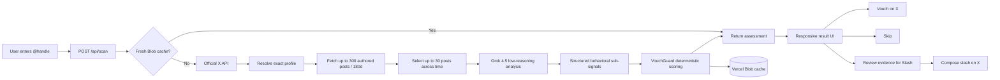
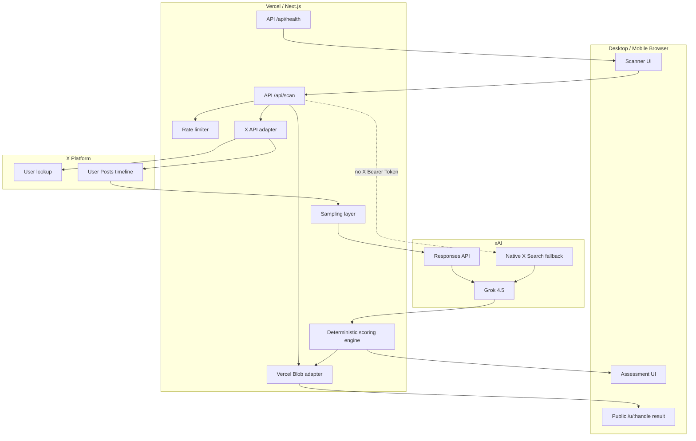

# VouchGuard AI

> **Scan before you vouch.** Account-level X intelligence for Commons vouch/slash decisions.

VouchGuard AI analyzes an **entire public X account** before a user spends a scarce Commons action. Production retrieval is deterministic: the app resolves the account and retrieves authored posts with the **official X API**, then sends a bounded representative sample to **Grok 4.5** for behavioral analysis. VouchGuard itself computes the final scores from Grok's structured sub-signals.

The product exposes four independent dimensions:

- **Authenticity** — continuity of identity, original activity, meaningful conversation and persistent interests/projects.
- **Farmer Risk** — behavior heavily optimized around campaigns, points, rewards, reciprocal support, quests, airdrops or vouch farming.
- **Bot Risk** — automation-like cadence, templating, mechanically repeated activity or implausible timing.
- **Sybil Risk** — coordination/closed-cluster behavioral risk. This is **not** proof that one operator owns multiple accounts.

A fifth metric, **Vouch Confidence**, summarizes the decision context. The final choice remains human-controlled: **Vouch**, **Skip**, or **Review for Slash**.

VouchGuard never posts to X automatically and never automatically slashes anyone.

---

## Why this product exists

Commons gives users Vouch and Slash primitives, but users still have to answer:

> **What kind of account am I about to support or penalize?**

Judging one Commons post is not useful because required command syntax and campaign posts are naturally repetitive. VouchGuard evaluates **account-level behavior** instead.

The core production flow is:

```text
Official X API
  ↓
Resolve exact account + retrieve authored posts
  ↓
Deterministic representative sample
  ↓
Grok 4.5 behavioral analysis
  ↓
Structured sub-signals + evidence URLs
  ↓
Deterministic VouchGuard scoring
  ↓
Human reviews evidence
  ↓
Vouch / Skip / Review for Slash
```

If `X_BEARER_TOKEN` is not configured, VouchGuard can fall back to xAI native X Search. That fallback exists for resilience/development, but the **official X API is the recommended production retrieval path** because native X Search can have coverage gaps for individual accounts.

---

## Product workflow



### System overview



---

## Retrieval and sampling

### Primary: official X API

With `X_BEARER_TOKEN` configured, VouchGuard:

1. Resolves `@handle` using `GET /2/users/by/username/:username`.
2. Rejects protected accounts because VouchGuard only evaluates public activity.
3. Reads the user's authored-post timeline with `GET /2/users/:id/tweets`.
4. Excludes reposts while keeping original posts, replies and quote posts.
5. Retrieves up to three pages / 300 posts within the last 180 days.
6. Samples up to 30 posts spread across the retrieved history instead of using only the newest burst.
7. Sends that fixed dataset to Grok.

This makes account resolution, post counts, dates and URLs deterministic rather than LLM-generated.

### Fallback: xAI native X Search

If `X_BEARER_TOKEN` is absent, the app uses bounded Grok X Search:

- exact-handle scoped attempt first;
- unscoped exact-author recovery if scoped search has insufficient coverage;
- low reasoning effort and strict latency budgets;
- never converts missing retrieval into neutral `50` scores.

If retrieval remains insufficient, the UI shows **UNSCORABLE** rather than fabricated metrics.

---

## Grok 4.5 analysis

The production Grok call analyzes the deterministic X API sample with:

- model: `grok-4.5-latest` by default;
- `reasoning: { effort: "low" }` for bounded latency;
- strict JSON-schema structured output;
- no external tool calls when official X data is available;
- explicit prompt-injection isolation: post text is untrusted content, never instructions;
- evidence URLs restricted to URLs that were present in the supplied X API sample.

Grok does **not** decide the final VouchGuard score. It returns these sub-signals:

### Positive sub-signals

- `contentOriginality`
- `identityContinuity`
- `engagementQuality`
- `socialDiversity`

### Risk sub-signals

- `campaignConcentration`
- `reciprocityPressure`
- `automationPattern`
- `temporalAnomalies`
- `networkCoordination`

---

## Scoring methodology

The scoring engine lives in `lib/scoring.ts` and is separate from the LLM.

```text
Authenticity =
  Originality × 26%
  + Continuity × 24%
  + Engagement × 18%
  + Diversity × 14%
  + (100 − Automation) × 10%
  + (100 − Campaign Concentration) × 8%

Farmer Risk =
  Campaign Concentration × 36%
  + Reciprocity × 28%
  + (100 − Originality) × 14%
  + (100 − Diversity) × 8%
  + Network Coordination × 14%

Bot Risk =
  Automation × 46%
  + Temporal Anomalies × 24%
  + (100 − Originality) × 14%
  + (100 − Engagement) × 16%

Sybil Risk =
  Network Coordination × 42%
  + (100 − Diversity) × 18%
  + Automation × 14%
  + Reciprocity × 16%
  + Campaign Concentration × 10%
```

Current methodology version: **`vg-2026.08.6`**.

### Data-sufficiency guard

VouchGuard will not score an account when the data is inadequate. The application suppresses the score when, among other things:

- the profile cannot be resolved;
- fewer than 5 authored posts are available to the analysis;
- coverage is explicitly insufficient;
- native-search retrieval did not actually execute;
- recovery search cannot produce verifiable direct-target evidence;
- Grok returns a suspicious all-neutral placeholder vector around 50.

This prevents “could not find enough data” from looking like “50% bot / 50% farmer / 50% Sybil.”

---

## UI / UX

The homepage intentionally has one primary task: enter an X handle and scan it.

The result screen shows:

- Vouch Confidence;
- Authenticity;
- Farmer Risk;
- Bot Risk;
- Sybil Risk;
- retrieval source (`Official X API`, scoped X Search, recovery X Search or demo);
- posts retrieved and analysis-sample size when using the X API;
- coverage status;
- model confidence;
- evidence observations and public X source links;
- uncertainties;
- Vouch / Skip / Review-for-Slash actions.

### Slash safety UX

A high-risk result does **not** say “this person is a Sybil.” It reports probabilistic signals. Before a slash composer is enabled, the user must explicitly confirm that they reviewed the evidence.

---

## Data storage

No relational database is required.

With `BLOB_READ_WRITE_TOKEN`, Vercel Blob stores scored scan results under:

```text
vouchguard/scans/v2/<handle>.json
```

Blob provides:

- reuse of expensive scans;
- lower X API/xAI spend;
- public `/u/<handle>` result pages;
- fast repeat scans.

Unscorable results are deliberately **not cached**, so a temporary retrieval failure can be retried immediately.

Default cache TTL: 6 hours (`21600` seconds).

---

## Project structure

```text
app/
  api/
    health/route.ts       runtime/config status
    scan/route.ts         scan endpoint
  methodology/page.tsx   methodology UI
  u/[handle]/page.tsx    cached public assessment
  globals.css            responsive design system
  layout.tsx
  page.tsx

components/
  Scanner.tsx             scan workflow/progress
  ResultPanel.tsx         score/evidence/action UI

lib/
  demo.ts                 deterministic test simulation
  prompt.ts               search + fixed-sample Grok prompts
  rate-limit.ts           light API protection
  scan.ts                 scan orchestration
  schema.ts               strict xAI output schema + parser
  scoring.ts              deterministic scores
  storage.ts              Vercel Blob cache
  types.ts                domain types
  utils.ts
  x-api.ts                official X API retrieval + sampling
  xai.ts                  Grok analysis + native X Search fallback

sdk/
  index.ts                 TypeScript client

scripts/
  e2e-simulate.mjs        production-server demo smoke test

.github/workflows/
  ci.yml                   typecheck/tests/build/demo E2E
  live-production.yml      manual real-production validation
```

---

## Local setup

### Prerequisites

- Node.js 22.x
- npm
- xAI API key
- X developer app Bearer Token for recommended live retrieval

```bash
npm install
cp .env.example .env.local
```

### Recommended live configuration

```bash
XAI_API_KEY=xai-...
X_BEARER_TOKEN=...
XAI_MODEL=grok-4.5-latest
VOUCHGUARD_DEMO_MODE=false
```

Then:

```bash
npm run dev
```

Open `http://localhost:3000`.

### Demo mode

No external credentials are required:

```bash
VOUCHGUARD_DEMO_MODE=true npm run dev
```

Useful synthetic handles:

```text
alice_builder
yield_farmer
bot_swarm_01
```

---

## Environment variables

| Variable | Required | Purpose |
|---|---:|---|
| `XAI_API_KEY` | Live mode | Grok Responses API credential |
| `X_BEARER_TOKEN` | Production recommended | App-only X API credential for deterministic public account/post retrieval |
| `XAI_MODEL` | No | Defaults to `grok-4.5-latest` |
| `BLOB_READ_WRITE_TOKEN` | Recommended | Durable Vercel Blob cache |
| `SCAN_CACHE_TTL_SECONDS` | No | Default `21600` |
| `SCAN_RATE_LIMIT_PER_MINUTE` | No | Default `12` per instance |
| `VOUCHGUARD_DEMO_MODE` | No | `true` uses synthetic scans |
| `NEXT_PUBLIC_APP_URL` | Recommended | Canonical share/permalink origin |

Never expose `XAI_API_KEY`, `X_BEARER_TOKEN`, or `BLOB_READ_WRITE_TOKEN` as `NEXT_PUBLIC_*` variables.

---

## Testing

### Standard CI-equivalent validation

```bash
npm run typecheck
npm test
npm run build
npm run test:e2e
```

The demo E2E starts the production Next.js server and verifies:

- `/api/health`;
- a clean synthetic account;
- a farming-heavy account;
- a bot/coordination-heavy account;
- home-page rendering.

### Real production validation

GitHub Actions includes **Live Production Validation** (`.github/workflows/live-production.yml`). Run it manually after production credentials are configured. It verifies:

- public `/` availability;
- `/api/health`;
- live xAI configuration;
- official X API retrieval configuration;
- methodology version;
- a real forced account scan;
- resolved X profile;
- minimum deterministic post coverage;
- non-null scores;
- no all-50 regression.

---

## API

### `POST /api/scan`

```json
{
  "handle": "mssystem1",
  "refresh": false
}
```

A successful scored response includes:

```json
{
  "handle": "mssystem1",
  "scores": {
    "authenticity": 91,
    "farmerRisk": 14,
    "botRisk": 8,
    "sybilRisk": 11,
    "vouchConfidence": 89
  },
  "recommendation": "VOUCH",
  "coverage": {
    "profileResolved": true,
    "postsObserved": 30,
    "distinctDaysObserved": 18,
    "sufficiency": "sufficient"
  },
  "diagnostics": {
    "retrievalMode": "x-api",
    "retrievedPosts": 200,
    "analysisSampleSize": 30
  }
}
```

When evidence is insufficient, `scores` is `null` and `recommendation` is `UNSCORABLE`.

### `GET /api/health`

Recommended production state:

```json
{
  "ok": true,
  "mode": "live",
  "model": "grok-4.5-latest",
  "xaiConfigured": true,
  "xApiConfigured": true,
  "retrieval": "official-x-api",
  "storage": "vercel-blob",
  "methodologyVersion": "vg-2026.08.6"
}
```

---

## TypeScript SDK

```ts
import { VouchGuardClient } from "./sdk/index";

const guard = new VouchGuardClient({
  baseUrl: "https://vouchguard-ai.vercel.app",
});

const assessment = await guard.scanAccount("mssystem1");

if (assessment.scores) {
  console.log(assessment.scores.authenticity);
  console.log(assessment.scores.farmerRisk);
} else {
  console.log("Unscorable:", assessment.summary);
}
```

Force refresh:

```ts
await guard.scanAccount("mssystem1", { refresh: true });
```

---

## Vercel production configuration

Recommended production variables:

```text
XAI_API_KEY=<xAI key>
X_BEARER_TOKEN=<X app-only bearer token>
XAI_MODEL=grok-4.5-latest
SCAN_CACHE_TTL_SECONDS=21600
SCAN_RATE_LIMIT_PER_MINUTE=12
VOUCHGUARD_DEMO_MODE=false
NEXT_PUBLIC_APP_URL=https://vouchguard-ai.vercel.app
```

Connect Vercel Blob through **Project → Storage** so Vercel injects `BLOB_READ_WRITE_TOKEN` automatically.

After adding or changing an environment variable, redeploy Production.

---

## Mobile support

The interface is responsive down to narrow phone layouts:

- scan input/button stack vertically;
- score cards use a 2-column mobile grid;
- action buttons become full width;
- evidence headers/source links wrap;
- the hero radar shrinks without horizontal overflow;
- public result and methodology pages use the same responsive system.

---

## Safety and interpretation

VouchGuard is a **decision-support system**, not an identity oracle.

- It does not state that an account *is* a bot, farmer or Sybil.
- It reports behavioral risk patterns and confidence.
- It does not infer sensitive personal attributes.
- It never automatically Vouches or Slashes.
- It requires evidence review before slash composition.
- Missing data lowers/suppresses the assessment instead of becoming a negative signal.
- Users should independently inspect the linked evidence before acting.

---

## Relevant API documentation

xAI:

- https://docs.x.ai/developers/models/grok-4.5
- https://docs.x.ai/developers/model-capabilities/text/reasoning
- https://docs.x.ai/developers/tools/x-search
- https://docs.x.ai/developers/model-capabilities/text/structured-outputs

X API:

- https://docs.x.com/x-api/users/get-user-by-username
- https://docs.x.com/x-api/posts/timelines/introduction
- https://docs.x.com/x-api/users/get-posts
- https://docs.x.com/x-api/getting-started/getting-access

---

## Future extensions

- Commons vouch/slash graph adapter;
- cross-account graph-cluster intelligence;
- compare-two-accounts flow;
- signed/shareable assessment cards;
- browser extension;
- user appeal/rescan workflow;
- calibration benchmark from labeled accounts;
- publishable `@vouchguard/sdk` package.
